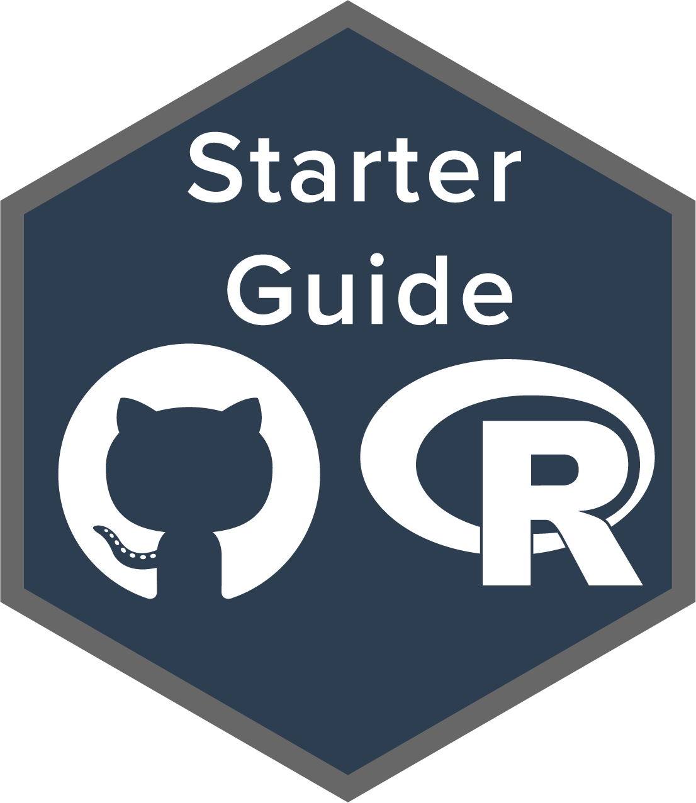
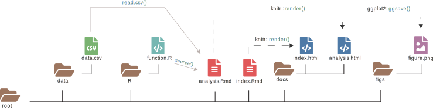

::: {.topnav}
<a href="index.html">GitHub and R guide</a> <a href="https://github.com/wyatt-toure/github-and-R-starter-guide" style = "float: right;"><i class="fab fa-github"></i> GitHub </a> <a href="resources.html" style = "float: right;"><i class="fas fa-toolbox"></i> Resources</a><a href="video-tutorial.html" style = "float: right;"><i class="fas fa-video"></i> Video tutorial</a><a href="written-guide.html" style = "float: right;"><i class="fas fa-book"></i> Written guide</a><a href="index.html" class="active" style = "float: right;"><i class="fas fa-home"></i> Home</a>
:::

M. Wyatt Toure[1]{.affil-mark}

[1]{.affil-mark}McGill University, Department of Biology, 1205 Docteur Penfield, Montreal, Quebec H3A 1B1, Canada

e-mail: `m_wyatt.toure@mail.mcgill.ca`

------------------------------------------------------------------------

{style="float: right; margin: 0% 0% 0% 5%;" width="200"}

Research can be messy and often during an undergraduate degree we learn a lot about theory and deciding what statistical tests to use but less about the practicalities of managing a research project. I myself was never sat down and told how I should structure the files of my projects or how to keep track of different file versions. Thus, through trial and error I have learned some tid-bits about research project management and methods for keeping track of all the materials that are produced in the process of conducting experiments. The goal of this site is to demonstrate the benefit of using GitHub and Rmarkdown, two tools which I learned about well past halfway through my MSc degree, which aid tremendously in version controlling and documenting analyses. On this site I share a brief [written guide](written-guide.html) and [video guide](video-guide.html) to using these tools as well as a [list of resources](resources.html) that help manage version controlled projects. 

*Note this site is a work in progress*. 

 

