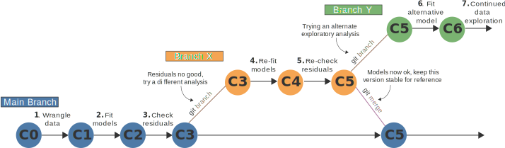

::: {.topnav}
<a href="index.html">GitHub and R guide</a> <a href="https://github.com/wyatt-toure/github-and-R-starter-guide" style = "float: right;"></img> GitHub</a> <a href="resources.html" style = "float: right;"></img> Resources</a><a href="video-tutorial.html" style = "float: right;"></img> Video tutorial</a><a href="written-guide.html" class="active" style = "float: right;"></i> Written guide</a> <a href="index.html" style = "float: right;"></img> Home</a>
:::

<p class="author-name">

M. Wyatt Toure[1]{.affil-mark}

</p>

<p class="author-affil">

[1]{.affil-mark}McGill University, Department of Biology, 1205 Docteur Penfield, Montreal, Quebec H3A 1B1, Canada

</p>

<p>

e-mail: `wyatt.toure@gmail.com`

</p>

------------------------------------------------------------------------

*Note this is a work in progress*

## Introduction

In research you will often find yourself handling several data, analysis code, manuscript, and figure files which can go through many intermediary stages based upon decisions you make during your project analysis. Not properly documenting changes across all these files and the decisions that underly these changes can lead to difficulties in re-tracing our steps [@perkel2020]. This then cascades into difficulties for others to retrace our steps [@ioannidis2009RepeatabilityPublishedMicroarray]. Moreover, in programming languages with large communities, such as R, many of these steps can be mediated by community built suites of functions that perform specific tasks called packages [@wickham2019WelcomeTidyverse; @bates2015FittingLinearMixedEffects]. Over time these packages can undergo changes across different versions that may change their behaviour in the future. Given the many software dependencies modern analyses typically rely on, the metadata concerning the software and software versions used can be just as crucial in reproducing an analysis as the code and data. Keeping track of data, code, software, and software versions are therefore important steps in reproducing analyses for yourself and others.

Fortunately, documenting each step of an analysis pipeline has never been easier via the combination of documentation software such as Rmarkdown with version control software such as *Git* and GitHub. With these tools we can reliably track changes in our project files and document key facts about an analysis such as what steps were run to transform the data, perform the analyses, and create the figures, making it easier to continuously work on, share, and re-visit project analyses. Combining these tools with an organized file structure helps tremendously in managing a research project but these skills are often not explicitly taught in typical science or statistics courses.

Here I give an overview on what I've found to be good practices for managing projects. I go over the principles and methods behind creating organized, version controlled, and documented directories for projects. These should allow one to share analysis materials and steps as well as keep track of changes made in the process of conducting an analysis for yourself, collaborators, and a wider audience.

## Project Directories

The first thing we should think about when starting a project is how we are going to organize our files. All your projects should have their own directories named after the project (do not just save individual files to the Documents folder). To keep the files within the project directory clear and organized it is good to separate components of a project that have a shared theme within their own subdirectories. I tend to like the following project structure for my work:

    .
    ├── ./LICENSE.md
    ├── ./README.md
    ├── ./my-analysis-project.Rproj
    ├── ./analysis.Rmd
    ├── ./data
    │   └── ./data/my-data.csv
    ├── ./docs
    │   └── ./docs/analysis.html
    ├── ./figs
    │   ├── ./figs/figure-1.png
    │   └── ./figs/figure-2.png
    └── ./R
        ├── ./R/function-one.R
        └── ./R/function-two.R

The above is called a directory tree and is used to represent a directory structure in plain text. The `.` represents the root directory (sometimes called the main directory) which is the directory you see when you first open the project directory and a `/` indicates something inside a directory. Therefore everything inside just `./` is in the root directory. In the root directory I have `LICENSE.md` which is a markdown file (a plain text file type that allows for formatting elements) that contains the software license for your project. A license basically dictates who can do what with your code. You can explore different licensing options at [choosealicense.com](https://choosealicense.com/){.uri}. I generally license the code in my projects under an MIT license which essentially lets people do anything they want with your code but you may opt for something else. For your figures and text you consider using a [Creative Commons Attribution (CC-BY) license](http://creativecommons.org/licenses/by/4.0/) which allows for re-use if the creator is credited.

`README.md` contains information about the contents of the directory and the project. I also place my `.Rproj` file (here named `my-analysis-project.Rproj`) in the root directory. An R project file makes it easier to keep R scripts from different projects separate from each other. The working directory of your R scripts is set to the location of the `.Rproj` file and since I like for all file paths to be relative to the root directory I keep the `.Rproj` file there. Finally, I also keep the Rmarkdown file, `analysis.Rmd` which contains the full analysis code and documentation explaining the code in the root directory.

Another `/` indicates a subdirectory. In the subdirectories I have:

-   `R/` which contains custom R functions relevant for the analysis

-   `data/` which contains the raw data used in the analysis

-   `docs/` which contains the documentation for the analysis

-   `figs/` which contains the figures generated from the code in the analysis script

My `docs/` and `figs/` directory are always populated with outputs produced in the `analysis.Rmd` script (see Figure 2). You might also include a `manuscript/` folder and write your manuscript in a file format that can be programmatically populated with your figures such as LaTex. However, you likely have to consider what format your collaborators will want to receive manuscripts for comments. It may be easier to use a common word processor like Microsoft Word for writing manuscripts.

## Using R

For this guide I am going to assume you are familiar with R as teaching you R is beyond the scope of this site but I will give a brief overview of R here. Before going further I should note that everyone who works with R will tell you to use [RStudio](https://www.rstudio.com/products/rstudio/download/#download) as your integrated development environment (IDE). An IDE contains a set of tools to make your life considerably easier while programming. RStudio provides a graphical user interface (GUI) fitted with a console, a syntax-highlighting editor that supports direct code execution, as well as tools for plotting, history, debugging and workspace management.

There are great books that are online for free if you need help getting started with R. If you have little to no programming experience you should read [Hands-On Programming with R](https://rstudio-education.github.io/hopr/index.html). If you have experience with programming [R for Data Science](https://r4ds.had.co.nz/index.html) may be a better fit.

R is a programming language which is specialised for data manipulation and analysis. With R one can write scripts that execute commands for tidying, manipulating, modeling, and visualising data. This means all commands that lead to your final results can be recorded within the script that produces your analysis providing a record of the steps you took. R programming is function orientated. Almost everything you do in R is done by calling functions. Typically you call functions on variables which have been assigned values. So input data is translated into output data with each function call. A simple example is below.

``` {.r}
# Assigning values to variables 
variable_a <- 3
variable_b <- 7

# Calling the sum() function on my variables
sum(variable_a, variable_b)

# Storing the output of a function in a variable
variable_sum <- sum(variable_a, variable_b)
```

In the above code chunk I am assigning `variable_a` and `variable_b` the values 3 and 7 respectively. I then call the `sum()` function which, as the name suggests, sums the values that the two variables have been assigned. Functions produce outputs which themselves can be stored in variables. This is done by assigning the function call to the variable `variable_sum`. Without assigning a function call to a variable, an output may be produced in the console but not stored anywhere in your script for you to do more tasks with.

### Good practices for writing code

Good code should be simple, readable, well-documented, and modular. Keeping a consistent style helps in making your code readable. I myself try to conform to the [tidyverse style guidelines](https://style.tidyverse.org/) when writing R code. To keep your code readable try to have clear, concise, and meaningful variable and function names. Additionally, make use of spaces and line breaks to keep distinct elements separate. A simple example is below.

``` {.r}
# Reading in data 
full_data <- read.csv("path/to/your-data.csv")

# Extracting male only data
male_data <- filter(full_data, sex == "M")
```

This block of code reads in our full data set and stores it into a variable called `full_data`. This data is then subset by sex using the `filter()` function (from the [`dplyr`](https://cran.r-project.org/web/packages/dplyr/vignettes/dplyr.html) package) so that only data for the males is extracted from the full data set. We store this in the variable `male_data`.

#### Comment your code

Always comment your code. Comments are what we call text inside a code script that is not executed. The purpose of comments is to explain the code being executed (though some programmers like [hiding easter eggs in the comments](https://abcnews.go.com/Technology/apollo-11s-source-code-tons-easter-eggs-including/story?id=40515222) too). In R, comments are added by typing `#` and following it with text. This text tends to briefly explain what the following line of code will do. There is an argument that well written code should not require comments, and in a sense this is true. If code is nicely factored, modular, and has clear informative function names then reading the script will be almost like reading prose. However, for documenting analysis code for research I think liberal use of comments is warranted since there is no guarantee that the person reading your code will have extensive programming experience. As a result I like to comment even things that are easily readable or obvious (*e.g.*, `read.csv()` obviously reads in the specified csv data file if you know what it does) because non-R users may also want to read your code or a less experienced R user may pick up your code to work on or adapt for their own purposes. Moreover, commenting code is good practice because it is tempting to think that you will remember why code was written in a particular way or for what purpose. This. is. a. lie. You will forget. I promise. Well commented code makes it easier for you and others to quickly gleam what the code snippets in a script are meant to do (or what you intend for them to be doing) and how they work.

#### Make it modular

In the 1600s a French philosopher by the name of Blaise Pascal wrote

> *I have made this longer than usual because I have not had time to make it shorter.*

He said this in reference to writing a letter though he could just as easily have been talking about writing code. Good code is typically written in short, independent chunks. This is the principle of making code modular. Code is broken up into distinct components that perform independent, specific tasks such as data extraction, or data cleaning, or data modeling. With modular code, changing one piece of code has no effect on another piece of code. This is useful for making code reusable given R scripts are essentially a series of function calls. An input is run through a function which produces an output. This output becomes the input for the next independent function which produces another output (Figure 1). For example, you might have a function that calculates a behavioural metric from your raw data and another that filters these data points by removing missing values.

Many R packages exist which contain useful pre-written functions that perform common tasks which are needed in the course of a standard analysis. The [tidyverse](https://www.tidyverse.org/) contains a set of convenient and widely used packages designed for data science [@wickham2019WelcomeTidyverse]. They involve tools for data manipulation and visualization and I highly recommend them. In particular, [`tidyr`](https://tidyr.tidyverse.org/) for standardising data formatting, [`dplyr`](https://dplyr.tidyverse.org/) for data manipulation, and [`ggplot2`](https://ggplot2.tidyverse.org/) for data visualisation.


For your project you may require custom functions not found in any standard packages to perform highly specific tasks. You should try to keep any custom functions you make in a `.R` ( R script) file separate from your main Rmarkdown analysis script and source them as needed in your analysis script.

This is useful for snippets of code that you repeatedly use throughout a script. Rather than copy and pasting certain steps that are performed multiple times, which is liable to copy-paste errors, writing a function that contains those steps and then calling that function when needed makes debugging easier. For example, if at some point you realize your code of interest is producing unexpected behaviour, rather than inspect all instances where you have copy and pasted code that performs task X you can simply inspect the function in its `.R` file, fix it there, and the changes will carryover to the entire script next time you run it.

A modular organizing principle informs how we structure our entire project. We have different discrete inputs (data and R functions) that serve a distinct purpose and are compiled into an Rmarkdown analysis script as needed with the `read.csv()` and `source()` functions to produce our outputs (results, analysis documentation, manuscript).

## Rmarkdown for integrated directories {#rmarkdown}

Rmarkdown is a free R package that provides a documentation format for data science. In an Rmarkdown file you can write executable documents that incorporates runnable code chunks and plain text outside the code chunks. This allows you to create a map of your project, making it easier for future you or others who are interested in your project to see exactly what code you ran to get the results and figures you did and why you ran particular models by allowing you to write documentation alongside code. Thus, the inputs (data, R functions), outputs (figures, model results), code, and documentation for an analysis are integrated into one file (Figure 2) whose changes can be tracked using version control software such as *Git*. Notably an Rmarkdown file is a plain text file format that can be rendered into several different file formats using the `render()` function on the Rmd file. Moreover, outputs such as plots generated within an Rmd script can be saved to external directories such as a `figs/` directory by specifying a line to do so within the Rmd script.

![Figure 2: An illustration of the directory organization for a complete analysis. The analysis.Rmd file serves as the core of the project. Data are read into the analysis script where functions are sourced when needed to perform data preparation and analysis. The results of the analysis are then rendered into their various output forms. In this case the analysis rendered into an html file in the docs directory for readers to see a write up of the analysis. Figures generated by the analysis are also stored within in the figs directory](images/directory-rendering.svg){#directory-organization}

The rendered html files can have additional formatting and integrate the figures generated by the analysis to make for a clearer presentation of the analysis. These files can be opened in a user's browser. Moreover, integrating Rmarkdown outputs with [GitHub Pages](https://pages.github.com/) allows one to host reader-friendly sites for your projects online. With GitHub pages a website can be generated from a directory of html files such as a `docs/` folder which contains html renderings of Rmarkdown files. This requires a file called `index.html` to be present in the directory the site is built from which can also be made using Rmarkdown.

## Keeping track of analysis steps {#tracking-analysis}

![Figure 3: Graphical demonstration of a branching work flow using Git. C0 - C4 represent commits which are snapshots of your directory. With Git each commit can be accessed so changes can always be rolled back. Δn represents the nth change in a file and version numbers for the file are in the top left corner of the file icon. Arrows connect changed files to their previous version. Plain lines represent an unchanged file. Above lines and arrows are the Git commands that correspond to the action being represents.](images/git-file-changing.svg){style="display: block;   margin-left: auto;   margin-right: auto;" width="700"}

### Before data are collected {#before-data}

There are steps that can be taken before data is even collected to make for a better documented project. Often experimental subjects are split into experimental treatments. You can start your `analysis.Rmd` script by programmatically assigning individuals to different treatment based on the criteria your experiment depends upon [@coppock2019RandomizrEasytoUseTools]. This can help in making you think early on explicitly about your experimental design and serve as a record of your design decisions.

Once individuals are assigned to treatments it is important to consider collecting the finest level of data possible. For example, if you wanted to determine whether fish weigh more than 10 grams, rather than record each fish as True (above 10 grams) or False (below 10 grams), recording the actual weight will provide more information in addition to allowing you to transform the data later. A more realistic example in animal behaviour is documenting the position of an animal through time. If the position of an animal is only sampled every minute rather than every second you may be losing additional useful data. However, these decisions must be made in the context in your experiment. If it is substantially more difficult to get fine grain data and coarse grain data will do then coarse grain data may be sufficient. Transformations to a coarser level of analysis can always be done but it is not possible to go from a coarse level of analysis to a fine level of analysis if only the coarse data are collected.

### Woes with data transformations {#transforming-data}

Performing transformations of the raw data into meaningful variables is often needed in the course of an analysis. Spreadsheet software (*e.g.,* Microsoft Excel) is often used to do these transformations manually and then save these changes into separate files. The idiosyncrasies and lack of a record of what was done and how when using spreadsheet based software can lead to difficulties in retracing one's steps or to outright errors [@ziemann2016GeneNameErrors]. Additionally, many researchers, including me, can tell you from experience that this is a bad practice. In my case, before I switched to programmatically creating new data files I would end up with directories with file names such as `data_new.csv`, `data_na_removed1.xlsx`, or `data_final_subset_realv3.csv` which were constructed by manually constructing new sheets with Excel---this is a terrible way to do this (see Figure 2 for a cursed directory of a guppy pilot project).

{#figure-horror style="display: block;   margin-left: auto;   margin-right: auto;"}

In this case it is very easy to lose track of how these files changed. This becomes even more difficult if it is converted from a format that keeps track of transformation formulas (.xlsx) to one that does not (.csv). We can alleviate these issues by doing data transformations programmatically. With a script that performs transformations, a record of how the transformation was done is always present. Thus, the cleaned data set can always be regenerated from the raw data set and the raw data need never be touched. However, since the code files which produce the cleaned data themselves have the potential to go through multiple versions, the problems with version control are not restricted to the raw data files. So rather than naming all of our files idiosyncratically we can make use of version control systems to keep track of changes in our entire project directory (Figure 3).

### Implementing version control {#version-control}

As we saw in my awful data directory, keeping track of different versions of files in our project is something we want to do but can be difficult to employ. To combat these issues we can make use of version control systems to manage continuously changing files within a directory. The most popular software used to do this is called *Git* [@blischak2016QuickIntroductionVersion]. Git allows you to experiment with your files without concern that you may permanently mess something up. When performing your analyses or cleaning your data your project may get to an intermediary state where the code is in a stable state but not yet finalized and you want to experiment further. What I used to do was just start writing and commenting out code back and forth within the script but this is a very haphazard way of doing things. There are two concepts in Git that make version controlling your files much easier, **commits** and **branching**.

It may help to think of a commit as taking a picture of what all the files in your directory currently look like (Figure 3). A commit essentially saves the state of your project directory and stores it. As a result every commit throughout the history of your project can be accessed. So during a day you might go through several iterations of a data cleaning script, finally get to one that works (or is part way there) and commit this version. Then you come back to your project and now fit a model to the data and check the model residuals. When you look at the model residuals you discover that there is variance heterogeneity so you will need to take a different statistical approach to account for this. You commit this version and will come back to try alternative approaches. You can make use of Git branches to maintain the state of your files in your project directory while experimenting with other models in a separate version of your directory.

Branches let you work on different versions of the same files in parallel. Edits in one branch will be independent of changes in another branch. This is particularly useful for collaborative projects as collaborators can work on their own sections of the same project in parallel with each potentially branch representing a parallel aspect of the project. You can also use branches for personal projects to work and experiment on a branched version of your project while your main branch remains unchanged and is always present for you to go back to. When you've added a feature that you are happy with *e.g.,* you created a function that cleans your data or you have completed one step of a bioinformatics pipeline, you can merge this branch to the main branch so that it becomes a part of your main directory which contains the fully functional scripts.

When committing changes you have to accompany the commit with a commit message. You will be tempted as a project goes on to have short uninformative commit messages such as "changes to file X". Resist this urge. Try to make commit messages as informative as possible, it will aid tremendously if you have to go back through your commits to investigate a particular change.

{width="997"}

GitHub is a service owned by Microsoft that allows one to store Git repositories online. These tools allow us to maintain an online record of file changes over time with each version being fully accessible should they need to be recalled in the future. GitHub lets you make private repositories so even if you don't end up making your GitHub repository public you can use it privately to keep track of your projects [@perez-riverol2016TenSimpleRules]. So you don't have to collaborate with GitHub but hosting a project on GitHub means at any time you can start collaborating with others easily. Additionally, you don't need to use GitHub to use Git. As the name suggests, GitHub is simply an online hub for Git repositories. You can host Git repositories locally without ever pushing changes to a server or you could get a personal internal server to remotely host your Git repository (a personal GitHub of sorts).

### Metadata documentation

It is good practice for each of your projects to create what is known as a README file and store this alongside your project code and data. These are typically made at the end of a project when you know what tools you have used but it is not a bad idea to fill this in as a you go. A README file is a plain text file (which makes it likely that it will always be able to be opened across many operating systems). After reading a README file it should be clear to a stranger what your project's purpose is, how it is structured, what tools were used to conduct the project (as well as how to install any software dependencies), and how to interpret the outputs.

Inside a README I tend to have a summary of the project, an explanation of the directory structure, descriptions of the variables in the data set, and the R packages and package versions I used to conduct the analysis. A useful tool for documenting the R packages used in an analysis is the [`reports`](https://easystats.github.io/report/) R package [@makowski2021AutomatedResultsReporting]. `reports` can automatically produce a table containing the name, version, and citation of the packages that you call in your script with the `library()` function and also reports the version of R you are using. The R package [`renv`](https://rstudio.github.io/renv/) is also useful for documenting software decencies. You can see other tools for reporting the software environment in the [Software documentation](resources.html#software-documentation) section of the resources page.

## Extended reproducibility

If we provide our code, data, documentation, software, software versions, and have the entire history of the project on GitHub, you might think that our project is as reproducible as it gets---not so. There might be dependencies in your operating system that are influencing the execution of your analysis. This is what leads to the dreaded "*Well it works on my computer*" problem you might sometimes run into when trying to run someone else's code. The solution to this is to get someone to essentially download your computer which can be done via containers. A container is a lightweight isolated executable package of software containing code and all the dependencies required to run the code. What this means is that there will not be conflicts in the execution of your analysis as a result of software differences between a separate machine with a different operating system and the machine that created the analysis code and container in the first place. Thus, containers allow your analyses to be fully reproduced across a wide range of computing platforms and across time. Docker is an open-source container program that provides a virtual environment that has all the software requirements of a project pre-installed [@boettiger2015IntroductionDockerReproducible]. This makes your software (in this case your analysis code) run independent of the system environment of the computer it is run on.

------------------------------------------------------------------------

## References
